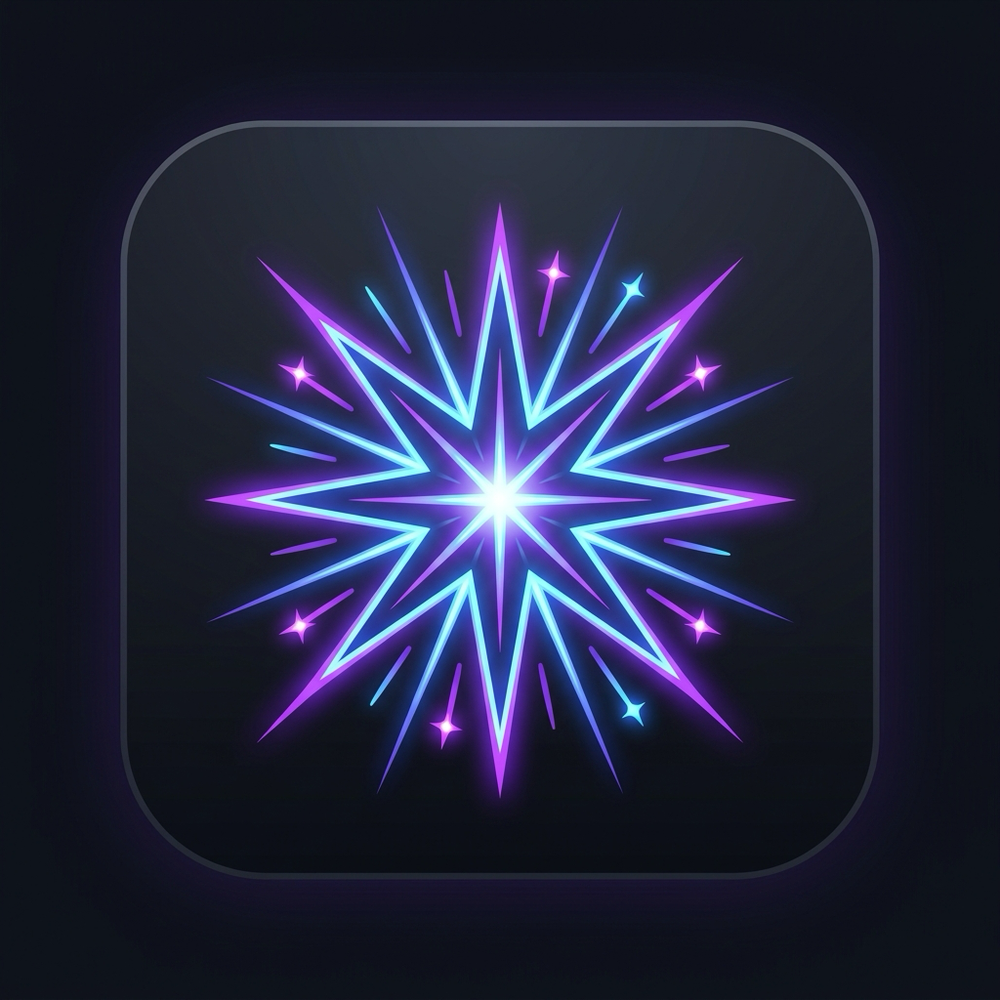
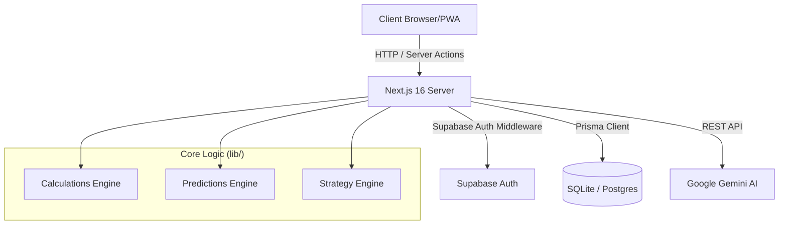

<div align="center">
  
  <h1>🌟 Lumos</h1>
  <p><strong>The Ultimate AI-Powered Academic Operating System</strong></p>

  <p>
    <a href="#features">Features</a> •
    <a href="#tech-stack">Tech Stack</a> •
    <a href="#architecture">Architecture</a> •
    <a href="#api-documentation">API Docs</a> •
    <a href="#folder-structure">Folder Structure</a> •
    <a href="#setup">Setup</a>
  </p>

  <p>
    
    
    
    
    
  </p>
</div>

---

## 📖 Project Description

**Lumos** (formerly AcademiQ) is a comprehensive, AI-driven academic operating system designed specifically for university students. It takes the guesswork out of academics by acting as a personalized advisor. Instead of manually tracking grades in spreadsheets, Lumos automatically predicts your future performance, calculates exact marks needed to reach target grades, analyzes your academic health, and provides strategic study plans generated by artificial intelligence.

Lumos is fully responsive, functions as a Progressive Web App (PWA), and boasts a beautiful, highly interactive interface powered by Framer Motion and Recharts.

---

## ✨ Features

- 📊 **Dynamic Grade Tracking:** Track semesters, subjects, and specific marking schemes.
- 🤖 **AI Academic Copilot:** A Gemini-powered AI chat that knows your entire academic history and advises you on strategy.
- 🎯 **What-If Simulator:** Interactive sliders to see exactly how your final SGPA/CGPA changes based on hypothetical exam scores.
- 📈 **Predictive Analytics:** Trend analysis utilizing historical data to predict your future grades before exams happen.
- 📑 **Smart OCR & Parsing:** Upload test papers or transcripts and let AI extract your marks and syllabus automatically.
- 📱 **Progressive Web App (PWA):** Installable on iOS and Android straight from the browser for a native app experience.
- 🌍 **Career & Pathway Mapping:** Track readiness for MS abroad or specific university requirements (e.g., TUM Germany) based on your exact credit distributions.
- 📤 **Comprehensive Exports:** Export your entire academic profile to beautifully formatted PDF, Excel, or CSV reports.

---

## 💻 Tech Stack

### Frontend
- **Framework:** [Next.js 16](https://nextjs.org/) (App Router)
- **Language:** [TypeScript](https://www.typescriptlang.org/)
- **Styling:** [Tailwind CSS](https://tailwindcss.com/)
- **Components:** [shadcn/ui](https://ui.shadcn.com/) (Radix UI)
- **Charts:** [Recharts](https://recharts.org/)
- **Animations:** [Framer Motion](https://www.framer.com/motion/)
- **State Management:** [Zustand](https://zustand-demo.pmnd.rs/)

### Backend
- **Database:** SQLite (Local/Dev) / PostgreSQL (Prod)
- **ORM:** [Prisma](https://www.prisma.io/)
- **Authentication:** [Supabase Auth](https://supabase.com/docs/guides/auth)
- **AI Integration:** Google Gemini AI SDK

---

## 🏗️ Architecture Overview

Lumos follows a modern, full-stack Next.js architecture heavily utilizing the App Router. 



1. **Authentication:** Handled completely on the edge using Supabase Middleware (`middleware.ts`). Protected routes redirect unauthenticated users to `/login`.
2. **Data Fetching:** A hybrid approach using React Server Components for fast initial loads and Client Components for interactivity.
3. **AI Layer:** The AI logic (`lib/ai`) injects the user's current database state (grades, attendance) into the prompt context so the AI can provide personalized advice.

---

## ⚙️ Environment Variables

To run this project locally, you must create a `.env.local` file in the root directory.

| Variable | Description | Required | Example |
|----------|-------------|----------|---------|
| `DATABASE_URL` | Prisma database connection string. | Yes | `"file:./dev.db"` |
| `NEXT_PUBLIC_SUPABASE_URL` | Your Supabase project URL. | Yes | `https://xyz.supabase.co` |
| `NEXT_PUBLIC_SUPABASE_ANON_KEY`| Supabase public anonymous key. | Yes | `eyJhbG...` |
| `GEMINI_API_KEY` | Google Gemini API key for AI features. | Yes | `AIzaSy...` |

> [!WARNING]
> Never commit your `.env.local` file to version control. It is already added to `.gitignore`.

---

## 🛣️ API Documentation

Lumos utilizes Next.js API Routes (`app/api/*`) for data processing, AI interactions, and file exports. Below is the route map.

### AI & Predictions
- `POST /api/ai/chat` 
  - **Body:** `{ message: string, history: Array }`
  - **Returns:** AI streaming response.
- `POST /api/ai/parse` 
  - **Body:** `FormData` (Images/PDFs)
  - **Returns:** `{ extractedData: Object }` - OCR extracted syllabus/marks.
- `GET /api/predictions/grade`
  - **Returns:** `{ predictions: Array }` - Predicted grades for current semester.
- `GET /api/predictions/trend`
  - **Returns:** `{ trend: "up" | "down" | "stable", nextCGPA: number }`

### Academic Entities
- `GET /api/semesters` - Fetch all semesters.
- `POST /api/semesters` - Create a new semester.
- `GET /api/subjects` - Fetch all subjects.
- `POST /api/subjects/[id]/marks` - Add marks for a subject component.
- `POST /api/attendance/manual` - Add manual attendance record.

### Exports
- `GET /api/export/pdf` - Returns binary PDF of academic report.
- `GET /api/export/excel` - Returns binary XLSX file.
- `GET /api/export/csv` - Returns text/csv representation of grades.

### Career & Strategy
- `GET /api/career/ms-abroad` - Returns credit analysis for MS applications.
- `GET /api/career/tum` - Specific requirement checks for TUM Germany.
- `GET /api/strategy/credit-impact` - Calculates mathematical weight of subjects on CGPA.

---

## 📂 Complete Folder Structure & File Responsibilities

Below is the exhaustive file structure of the Lumos codebase and the exact purpose of every file and directory.

<details>
<summary><strong>Click to expand the full directory tree</strong></summary>

```text
.
├── app/                        # Next.js App Router root
│   ├── (app)/                  # Protected authenticated routes group
│   │   ├── dashboard/          # Main user dashboard overview
│   │   ├── calculator/         # Advanced SGPA/CGPA calculator
│   │   ├── career/             # Career & MS Abroad pathway mappers
│   │   ├── chat/               # Dedicated AI Copilot UI
│   │   ├── compare/            # Multi-semester visual comparison tool
│   │   ├── export/             # Data export hub (PDF/Excel)
│   │   ├── health/             # Semester health & risk analysis
│   │   ├── marking-schemes/    # CRUD for custom university marking schemes
│   │   ├── grade-scales/       # CRUD for custom university grade scales
│   │   ├── marks/              # Centralized marks entry portal
│   │   ├── notes/              # Subject specific notes and attachments
│   │   ├── predictions/        # Future grade and trend predictions
│   │   ├── profile/            # User profile and university settings
│   │   ├── pyq/                # Previous Year Questions analyzer
│   │   ├── scanner/            # OCR Document scanner for syllabus/marks
│   │   ├── semesters/          # Semester management
│   │   ├── strategy/           # AI-generated study priority lists
│   │   ├── subjects/           # Subject management and deep-dives
│   │   ├── transcript/         # Full academic transcript view
│   │   └── what-if/            # Interactive grade simulator sliders
│   ├── (auth)/                 # Public unauthenticated routes
│   │   ├── login/              # Supabase Login page
│   │   └── register/           # Supabase Registration page
│   ├── api/                    # Next.js Serverless API endpoints (See API Docs)
│   ├── auth/                   # Auth callback endpoints
│   ├── globals.css             # Global stylesheet & Tailwind CSS variables
│   ├── icon.png                # Next.js default favicon (Lumos logo)
│   └── layout.tsx              # Root HTML layout and providers
│
├── components/                 # Reusable React components
│   ├── attendance/             # Attendance heatmaps & calculators
│   ├── career/                 # University fit cards & checklists
│   ├── charts/                 # Recharts graphs (Trends, Pies, Bars)
│   ├── chat/                   # AI chat interface elements
│   ├── dashboard/              # Dashboard summary cards & alerts
│   ├── layout/                 # Sidebar, Header, MobileNav, PageHeader
│   ├── motion/                 # Framer Motion animated wrappers
│   ├── scanner/                # File uploaders & OCR confirmation tables
│   ├── shared/                 # Empty states, loading skeletons, error boundaries
│   ├── simulator/              # Sliders and simulation badges
│   ├── subjects/               # Subject-specific tabs and forms
│   └── ui/                     # shadcn/ui generic primitive components (Buttons, Inputs)
│
├── lib/                        # Core Application Business Logic
│   ├── achievements/           # Gamification and badge logic
│   ├── ai/                     # LLM Routers, Prompt Builders, Context Injectors
│   ├── alerts/                 # Risk detection algorithms (e.g., failing attendance)
│   ├── analysis/               # Health calculation logic
│   ├── animations/             # Framer Motion variant presets
│   ├── calculations/           # Pure math functions for SGPA/CGPA/Attendance
│   ├── career/                 # Curriculum mapping algorithms
│   ├── export/                 # PDF (jspdf) and Excel (xlsx) generation logic
│   ├── predictions/            # Historical data trend algorithms
│   ├── strategy/               # Credit impact weighting logic
│   ├── supabase/               # Supabase Client and Server initializers
│   ├── prisma.ts               # Prisma ORM singleton instance
│   ├── utils.ts                # Tailwind merge and generic utilities
│   └── validators.ts           # Zod schemas for form validation
│
├── prisma/                     # Database ORM Configuration
│   ├── schema.prisma           # Database schema definition
│   └── seed.ts                 # Dummy data population script
│
├── public/                     # Static Assets (served at /)
│   ├── icon-192x192.png        # PWA Mobile Icon
│   ├── icon-512x512.png        # PWA High-Res Icon
│   └── manifest.json           # PWA Configuration Manifest
│
├── stores/                     # Global State Management
│   └── academic-store.ts       # Zustand store for caching academic data
│
├── types/                      # Global TypeScript definitions
│   └── career.ts               # Interfaces for MS Abroad parsing
│
├── components.json             # shadcn/ui configuration file
├── middleware.ts               # Edge middleware for Supabase Session persistence
├── next.config.ts              # Next.js config (Turbopack, PWA wrapping)
├── package.json                # Project dependencies and npm scripts
├── postcss.config.mjs          # Tailwind CSS PostCSS processing config
├── rename.js                   # Utility script (safe to remove)
├── tailwind.config.ts          # Tailwind theme, colors, and plugin config
└── tsconfig.json               # TypeScript compiler configuration
```
</details>

---

## 🛠️ Setup Instructions

Follow these steps to run Lumos locally on your machine.

### 1. Clone and Install
```bash
# Clone the repository
git clone https://github.com/your-username/lumos.git

# Navigate into the project
cd lumos

# Install dependencies (NPM)
npm install
```

### 2. Configure Environment Variables
Copy the example environment file and fill in your Supabase and Gemini keys.
```bash
cp .env.example .env.local
```

### 3. Database Setup (Prisma + SQLite)
Generate the Prisma client and push the schema to your local SQLite database.
```bash
# Push schema to database
npx prisma db push

# (Optional) Seed the database with test data
npx prisma db seed
```

### 4. Run the Development Server
Start the Next.js development server with Turbopack enabled.
```bash
npm run dev
```
Navigate to `http://localhost:3000` in your browser.

---

<div align="center">
  <p>Built with ❤️ by Lovejeet Singh</p>
</div>
